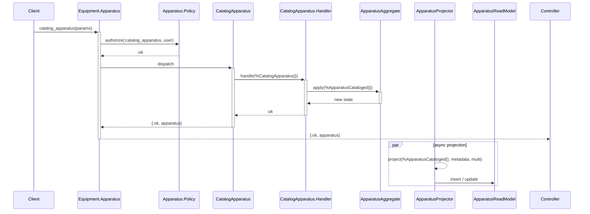

# Software Plan Format

## Overview

A software plan is a high-level design artifact that captures the architecture of
exactly ONE domain operation. It is produced by the Software Architect and
consumed by the Backend Engineer. It focuses on **what** to build (module names,
roles, APIs, flow) — not **how** to build it (that lives in implementation skills).

All examples in this skill use the `catalog-apparatus` operation from the
catalog subdomain. See the [naming substitution](../../../docs/architecture/naming-substitution.md)
doc for the placeholder conventions used.

## Structure

A software plan has four parts:

```
┌─────────────────────────────────┐
│  YAML Frontmatter               │ ← metadata for the builder
├─────────────────────────────────┤
│  Mermaid Class Diagram          │ ← structural roles + relationships
├─────────────────────────────────┤
│  Mermaid Sequence Diagram       │ ← behavioral flow
├─────────────────────────────────┤
│  Module Table                   │ ← full module names + file paths
└─────────────────────────────────┘
```

---

## 1. YAML Frontmatter

Minimal structured metadata for the builder to reference:

```yaml
---
operation: catalog-apparatus
type: command
subdomain: catalog
composite: equipment
constituent: apparatus
---
```

---

## 2. Mermaid Class Diagram

Shows the module as a class with an architectural role stereotype (`<<role>>`)
and its public fields. Arrows show the directional relationship between modules.

### Stereotypes

| Stereotype | Applies to |
|---|---|
| `<<Command>>` | Command struct |
| `<<CommandHandler>>` | Handler module |
| `<<Aggregate>>` | Aggregate with `apply/2` |
| `<<Event>>` | Event struct |
| `<<Projector>>` | Projection module |
| `<<ReadModel>>` | Ecto read model |
| `<<Policy>>` | Authorization policy |
| `<<PublicAPI>>` | Public API entry point |
| `<<Controller>>` | Phoenix controller |
| `<<View>>` | JSONAPI view |
| `<<Query>>` | Ecto query |
| `<<InternalAPI>>` | Internal API |
| `<<Validator>>` | Custom Vex validator |

### Arrow Semantics

| Arrow | Meaning |
|---|---|
| `A --> B` | A dispatches to / calls B |
| `A --> B` | A handles / processes B |
| `A --> B` | A evolves / applies B |
| `A --> B` | A projects / writes to B |
| `A --> B` | A guards / authorizes B |

### Example

```mermaid
classDiagram
    class CatalogApparatus {
        <<Command>>
        +title: string
        +slug: string
        +description: string (optional)
    }
    class CatalogApparatusHandler {
        <<CommandHandler>>
        +handle(aggregate, command)
    }
    class ApparatusAggregate {
        <<Aggregate>>
        +id: UUID
        +title: string
        +slug: string
        +description: string
        +apply(aggregate, event)
    }
    class ApparatusCataloged {
        <<Event>>
        +id: UUID
        +title: string
        +slug: string
        +description: string
    }
    class ApparatusProjector {
        <<Projector>>
        +project(%ApparatusCataloged{}, metadata, multi)
    }
    class ApparatusReadModel {
        <<ReadModel>>
        +id: UUID
        +title: string
        +slug: string
        +description: string
    }
    class ApparatusPolicy {
        <<Policy>>
        +authorize(action, user, params)
    }
    class Apparatus {
        <<PublicAPI>>
        +catalog_apparatus(params)
    }
    class ApparatusInternal {
        <<InternalAPI>>
        +apparatus_by_id(id)
        +apparatus_by_id!(id)
    }
    class UniqueSlugValidator {
        <<Validator>>
        +validate(value, context)
    }

    ApparatusController --> Apparatus : calls
    Apparatus --> ApparatusPolicy : authorizes
    Apparatus --> CatalogApparatus : dispatches
    CatalogApparatusHandler --> CatalogApparatus : handles
    CatalogApparatusHandler --> ApparatusAggregate : evolves
    ApparatusAggregate --> ApparatusCataloged : produces
    ApparatusProjector --> ApparatusCataloged : projects
    ApparatusProjector --> ApparatusReadModel : writes to
    UniqueSlugValidator --> CatalogApparatus : validates
    Apparatus --> ApparatusInternal : delegates to
```

### Rules

- Include ONLY modules for the named operation. No sibling or unrelated modules.
- List public fields for commands, events, and read models (the data contract).
- List public function signatures for PublicAPI, InternalAPI, and Controller.
- For macros (like Projector's `project`), show the conceptual signature.
- Omit implementation details (private functions, internal logic).

---

## 3. Mermaid Sequence Diagram

Shows the flow of a request through the system. Participants use readable aliases.
Focus on the happy path; skip error handling.

For commands, the projector runs asynchronously after the event is committed.
Show it as a separate phase after the synchronous request flow.

### Example



### Rules

- Use `->>+` for calls and `-->>-` for returns (activation/deactivation).
- Label arrows with the function call or message.
- Show authorization check (policy call) as early as possible.
- For commands: Controller → API → Policy → Command → Handler → Aggregate.
  Then show the async projection phase separately.
- For queries: Controller → API → Policy → Internal API → Query → ReadModel.

---

## 4. Module Table

A markdown table with three columns: Module, Role, and File. Lists every module
the operation needs.

### Example

| Module | Role | File |
|---|---|---|
| `Sportipedia.Catalog.Equipment.Apparatus` | Public API | `services/api/lib/sportipedia/catalog/equipment/apparatus/public_api.ex` |
| `Sportipedia.Catalog.Equipment.Apparatus.Command.CatalogApparatus` | Command | `services/api/lib/sportipedia/catalog/equipment/apparatus/operation/catalog_apparatus/command.ex` |
| `Sportipedia.Catalog.Equipment.Apparatus.Command.CatalogApparatusHandler` | Handler | `services/api/lib/sportipedia/catalog/equipment/apparatus/operation/catalog_apparatus/handler.ex` |
| `Sportipedia.Catalog.Equipment.Apparatus.Event.ApparatusCataloged` | Event | `services/api/lib/sportipedia/catalog/equipment/apparatus/events/apparatus_cataloged.ex` |
| `Sportipedia.Catalog.Equipment.Apparatus.Validators.UniqueSlug` | Validator | `services/api/lib/sportipedia/catalog/equipment/apparatus/validators/unique_slug.ex` |
| `Sportipedia.Catalog.Equipment.Apparatus.ApparatusAggregate` | Aggregate | `services/api/lib/sportipedia/catalog/equipment/apparatus/aggregate.ex` |
| `Sportipedia.Catalog.Equipment.Apparatus.ApparatusInternal` | Internal API | `services/api/lib/sportipedia/catalog/equipment/apparatus/internal.ex` |
| `Sportipedia.Catalog.Equipment.Apparatus.Policy` | Policy | `services/api/lib/sportipedia/catalog/equipment/apparatus/policy.ex` |
| `Sportipedia.Catalog.Equipment.Apparatus.ApparatusProjector` | Projector | `services/api/lib/sportipedia/catalog/equipment/apparatus/projector.ex` |
| `Sportipedia.Catalog.Equipment.Apparatus.ApparatusReadModel` | ReadModel | `services/api/lib/sportipedia/catalog/equipment/apparatus/read_model.ex` |

### Rules

- Derive file paths from architecture conventions (documentation), not from existing code.
- Include registration files (router entries, commanded router, supervisor) if they are part of the operation.
- Omit test files; they follow the same path convention as the module they test.

---

## Constraints

- **One operation per plan.** Never combine multiple operations into a single artifact.
- **High-level only.** The plan describes structure and flow, not implementation details.
- **Docs-first.** Derive module names, file paths, and conventions from documentation.
  Never read implementation code for patterns.
