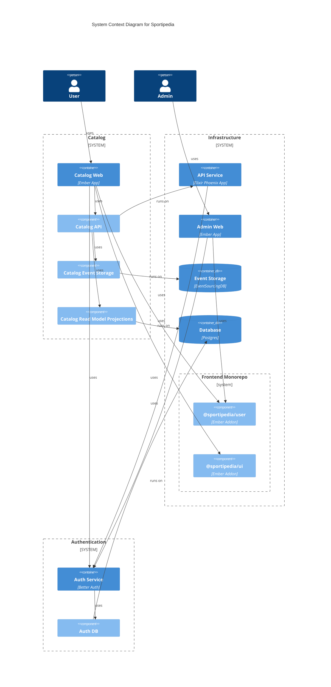

# Architecture

The project Sportipedia aims to help people in executing their movement skils,
especially on the technical aspects.

## Domain Model

We are in the domain of sport, specifically targetting technical training and
the underlying movement knowledge (part of movement science). The system is
language wise a bounded context in the domain of sport science.

See [Domain Model](./docs/domain-model/README.md) for details.

## Directory Strutcure

The directory is partially organized around deployment units.

- [`apps/`](./apps/) - All frontend apps
- [`docs/`](./docs/) - Documentation about the entire domain and software system
- [`packages/`](./packages/) - Generic subdomain / Internal packages
- [`services/`](./services/) - Microserives (generic and core subdomains)
- [`support/`](./support/) - Supporting subdomain with its software components

## Subdomains

### Core Subdomains

Each core subdomain describes its own architecture, refer to them individually:

- [Catalog](./docs/architecture/catalog.md)

### Supporting Subdomains

As there are more than one web apps, the frontend itself has a monorepo, which
has several supporting packages in that regard.

Location: `/support/`

### Generic Subdomains

General purpose components are usually off-the-shelf products. They appear as
two forms within this software system:

#### 1. Dedicated Services

They are represented through their own container/component in the software
system. That is the idea for these third-party products is to run them on your
own. For example the authentication subdomain uses `better-auth`, which is its
own service.

Location: `/services/`

#### 2. Technical Components

A technical need in other places. Can be a copy of the third-party product with
customizations needed for this codebase, eg. to shortcut development and
"self-host" until the customizations are implemented upstream. They are
considered temporary and subject of removal once capabilities are available by
the third-party product itself.

Location: `/packages/`

## Software System

The entire software system and its technical infrastructure can be represented
using the C4 Model.

Sportipedia is a set of manageable microservices, each a container according to
the C4 Model. Some containers are used for multiple subdomains. They are
properly namespaced to not interfere and _can_ be treated as their own
microservice. For ease of deployment, this will be one services serving multiple subdomains.

## Architecture Decisions

Architecture decisions are documented in [architecture decisions
records](./docs/adrs/).
